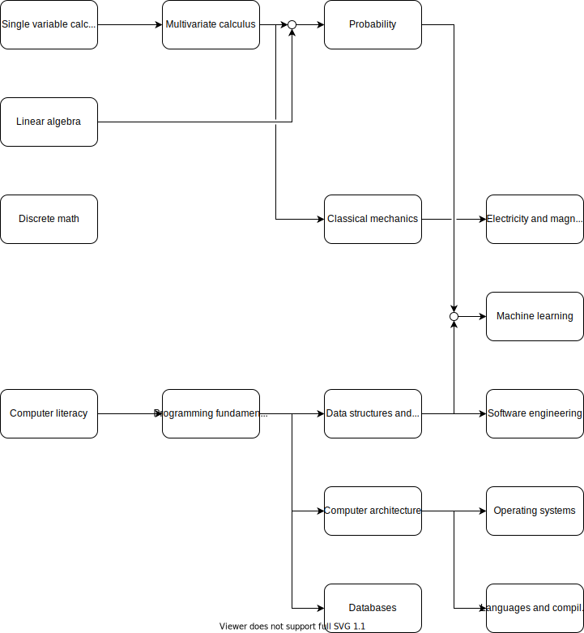

# Learning resources

## Computer science (undergraduate)

### Math

1. [Linear algebra](subject/math/linear-algebra)
2. [Single variable calculus](subject/math/single-variable-calculus)
3. [Probability](subject/math/probability)
5. [Multivariate calculus](subject/math/multivariate-calculus)
5. Logic and set theory
6. Discrete mathematics

### Physics

1. [Classical mechanics](subject/physics/classical-mechanics)
2. [Electricity and magnetism](subject/physics/electricity-magnetism)

### Computer science

1. [Programming fundamentals](subject/computer-science/programming-fundamentals)
2. Data structures and algorithms
3. Computer architecture
4. Software engineering
5. Operating systems
6. Databases
7. Computer networking
8. Computer graphics